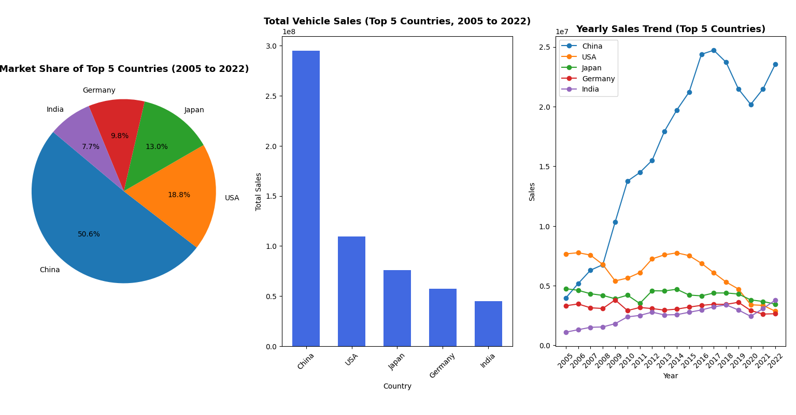

# 🚗 Vehicle Sales Trends Visualization

This project analyzes and visualizes vehicle sales data by country over time using **Python**, **Pandas**, and **Matplotlib**.  
It highlights the top-performing countries, total sales distribution, and yearly sales trends from 2005 to 2022.

---

## 📊 Features

- Loads and processes CSV vehicle sales data
- Calculates total sales per country
- Identifies the **top 5 countries** by total sales
- Generates:
  - **Pie chart** – Market share of top 5 countries  
  - **Bar chart** – Total vehicle sales (Top 5 countries)  
  - **Line chart** – Yearly sales trend (Top 5 countries)

---

## 📁 Project Structure

vehicle-sales-trends/
├── visualize_sales.py # Main analysis and visualization script
├── README.md # Project documentation
├── .gitignore # Git ignore configuration
└── sales_data.csv # Dataset file (not uploaded to GitHub)

---

## ⚙️ Requirements

Make sure you have Python 3.8+ installed, then install the required libraries:

pip install pandas matplotlib

▶️ Usage

Open the project folder in VS Code or your preferred IDE.

Ensure the dataset (sales_data.csv) is located in the vehicle_sales_trends/ folder.

Run the script:
    python visualize_sales.py

A visualization window will open displaying:

A Pie Chart (Market Share of Top 5 Countries)

A Bar Chart (Total Sales Comparison)

A Line Chart (Yearly Sales Trend)

📈 Example Output

The visualization includes three charts in a single figure:

(The figure shows the pie, bar, and line charts for the top 5 countries by vehicle sales.)

Market Share (Pie Chart) – Shows the proportion of total sales by each top country.

Total Vehicle Sales (Bar Chart) – Compares the overall sales volume.

Yearly Sales Trend (Line Chart) – Displays sales growth or decline from 2005–2022.

🧠 Author
Reinhard Biney Adjei
📧 bineyreinhard@gmail.com

🪪 License

This project is licensed under the MIT License – see the LICENSE
 file for details